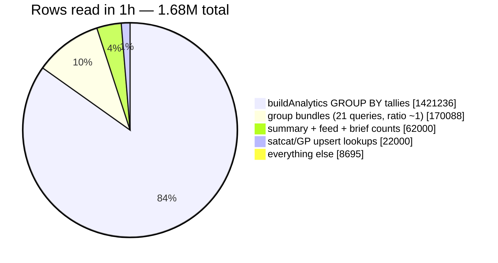
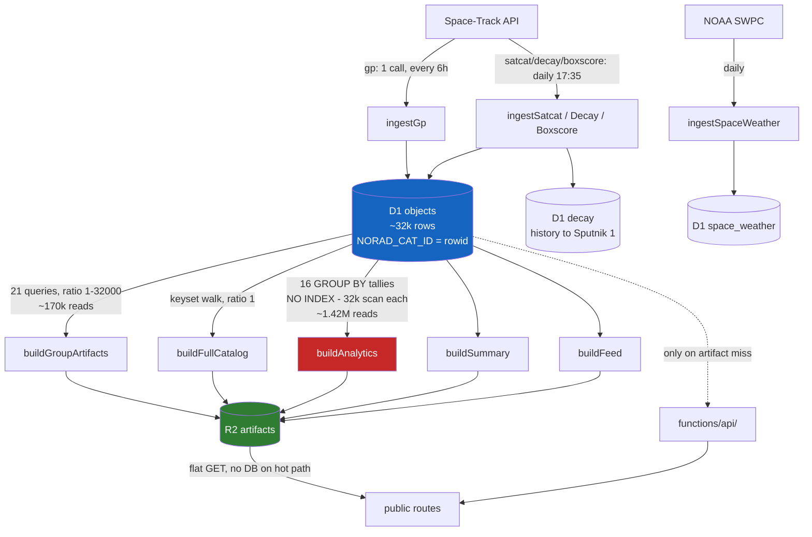

# D1 read model — where the rows go, and why

Reference for anyone looking at a Cloudflare D1 rows-read number for this project
and trying to work out whether it is a bug or the job. Written 2026-08-26 from
`d1QueriesAdaptiveGroups` (the real dashboard dataset), not from a cost model —
the cost model has been wrong three times now.

Run the export yourself before trusting anything below:

```bash
node workers/orbit-ingest/scripts/d1-query-stats.mjs --hours 1
```

Needs `CLOUDFLARE_ANALYTICS_TOKEN` with **Account · Account Analytics · Read**
(not the D1:Edit token the ingest uses — that one returns an empty `accounts`
array, which looks exactly like "no data"). This scope was added 2026-08-26 and
the script now works.

---

## The one rule everything follows

**D1 bills rows the engine *visits*, not rows returned.** A `LIMIT` bounds the
output, never the scan behind it.

So the only useful column is **`rows read / rows returned`**:

| Ratio | Meaning |
|---|---|
| ~1 | Index seek. Reading exactly what it returns. This is the floor. |
| 2–10 | Index seek with a filter on top. Fine. |
| 100+ | A scan wearing a `LIMIT`. **This is the bug shape.** |
| ~catalog size | Full table scan per call. |

Neither `Count` nor `Rows read` alone tells you anything. A query with a huge
`Count` may be the ingest doing its job; a query with one call may be scanning
32k rows to return 4.

---

## Two kinds of cost, which get confused constantly

Ratio-1 reads are **not waste**. This is the point people trip on.

```
active bundle:  reads 18,585  →  writes 18,585 objects into active.txt
```

You cannot emit a satellite into a file without reading its row. Ratio 1 is the
definition of the work, not a symptom. There is no schema, index, or rewrite
that reads fewer rows than it returns.

The real failure modes are different from each other:

| Kind | Shape | Example | Fix |
|---|---|---|---|
| **Re-reading** rows you already read | `OFFSET` paging | page *k* re-walks the whole prefix | keyset cursor — **done**, `3445edf8` |
| **Reading** rows you never return | no index for the predicate | `stations` visits 32k, returns 1 | schema change — open |
| Aggregating over the whole table | `GROUP BY` with no index | `RCS_SIZE` tally, 64,781/call | one in-memory pass — **done 2026-08-26** |

---

## Where the rows actually go

Measured over one hour, 2026-08-26 (a `daily` run plus a `gp` run):

```
1h total: 1,684,019 rows read
```

**Read that hour as one daily run, not as a rate.** The 17:xx hour is when the
daily job fires, so it contains the expensive tallies. Extrapolating it to
40M/day is wrong — the actual daily figure is below.



**`buildAnalytics()` is ~84% of the read cost.** The 21 group bundles that the
whole 2026-08-25 session was spent optimising are about 10%.

### The top offenders, exact

| Rows read | Calls | Returned | Ratio | Query |
|---|---|---|---|---|
| 647,810 | 10 | 40 | **16,195** | `SELECT RCS_SIZE, COUNT(*) … WHERE DECAY_DATE IS NULL GROUP BY k` |
| 643,650 | 10 | 80 | **8,046** | `SELECT (launch_year/10)*10, COUNT(*) … GROUP BY k` |
| 129,556 | 4 | 4 | **32,389** | `SELECT COUNT(*) FROM objects WHERE DECAY_DATE IS NULL` |
| 97,464 | 3 | 3 | **32,488** | `SELECT COUNT(*) FROM objects` |
| 72,288 | 72 | 72,000 | **1** | group bundle page (healthy, for contrast) |

The first two are ~1.29M rows read to produce **120 rows of output**. Every one
of `buildAnalytics()`'s ~16 `tally()` calls is a `GROUP BY` over the full
`objects` table with no index that can serve it, so each scans ~32k rows.
Sixteen of them, times however many times the artifact is rebuilt.

**There is no 10x multiplier — that was a misreading.** The 10 calls all fall in
a single hour bucket (17:00 UTC), which is the daily cron slot; no other hour has
any. `buildAnalytics()` runs once a day as wired. The cost is per-call, not a
runaway loop. **Fixed 2026-08-26** — see below.

---

## What the 2026-08-25 session fixed, and what it missed

Fixed, and confirmed gone from the live query set:

- **`OFFSET` paging** (`3445edf8`) — was 405k rows to return 27k, 15×. The 1h
  and 3h windows now contain **zero** `OFFSET` queries. Only the 6h/24h windows
  still show them, from pre-fix runs.
- **`/api/decay-watch`'s `GROUP BY … MAX()`** — was 144,153 rows read *per
  call*. Also absent from the recent windows.
- **Mis-planned name indexes** (`e19c9516`) — the 8 name-prefix groups now
  report ratio ~1–2.

Missed, because the session never looked past the `TLE_LINE1` queries:

- **`buildAnalytics()`**, which is ~5× the cost of everything it did fix.

The reason it was missed is instructive: the dashboard was sorted by `Count`,
and the group-bundle queries dominate `Count` (21 bundles × 4 runs/day, paged).
`buildAnalytics()` runs a handful of times and hides near the bottom of a
count-sorted list while reading five times as much. **Sort by rows read, then by
ratio. Never by count.**

---

## The group bundles: settled, do not re-open

All 21 measured with a counting UDF over a seeded 31k catalog. Three buckets:

| Bucket | Groups | Ratio | Status |
|---|---|---|---|
| Name-prefix seek | starlink, oneweb, qianfan, hulianwang, galileo, beidou, irnss, sbas | 2 | optimal |
| Type/country partition | active, geo, weather, resource, gps-ops, iridium-next, glo-ops, 4 debris families | 1–133 | index-optimal |
| No usable index | `stations`, `military`, `last-30-days` | ~32,000 | unfixable at query level |

Two cost-model errors corrected by measurement — **do not repeat them**:

- **`active` is ratio 1, not 19.** `NORAD_CAT_ID` **is the rowid**
  (`INTEGER PRIMARY KEY`), so `idx_objects_type` resolves as
  `(OBJECT_TYPE=? AND rowid>?)` and the keyset cursor is pushed *inside* the
  index seek. Its 19 pages make one continuous pass, not 19 partition walks.
- **A `(OBJECT_TYPE, NORAD_CAT_ID)` composite index is ignored by the planner**,
  for the same reason — every index already carries the rowid as its trailing
  key, so `idx_objects_type` supplies that ordering free. Proposed, EXPLAINed,
  rejected before paying write cost.

Every query-level fix for the last three was tried and is worse: a name hint on
`military`/`stations` gives `SCAN` + `USE TEMP B-TREE FOR ORDER BY`; a
`LAUNCH_DATE` index for `last-30-days` is ignored. Their predicates cannot
combine with the mandatory `DECAY_DATE IS NULL AND TLE_LINE1 IS NOT NULL`
through any single index.

---

## Why paging is *not* the cost any more

A recurring confusion worth settling in writing.

**Old (`OFFSET`)** — SQLite cannot seek to an offset. It starts at row 1 and
reads-and-discards everything before the offset:

```
page 1:  reads  1,000 → returns 1,000
page 2:  reads  2,000 → returns 1,000   (1,000 discarded)
page 3:  reads  3,000 → returns 1,000   (2,000 discarded)
...
page 19: reads 19,000 → returns   585
  total ≈ 190,000 reads for 18,585 rows
```

**New (keyset)** — `WHERE NORAD_CAT_ID > 44713` descends the B-tree straight to
that key, because it is the rowid:

```
page 1..19: reads 1,000 each → returns 1,000 each
  total = 18,585 reads for 18,585 rows
```

**Page size no longer affects total reads at all.** 1,000 per page or all 18,585
in one shot costs the same. Paging exists only because D1 caps result-set size —
an unpaged `SELECT` would work in dev and silently truncate in production. It is
a correctness guard that now costs nothing.

A related confusion: a run total far larger than the catalog does not mean there
is more data than you think. There is one `objects` table of ~32k rows. The 21
bundles are 21 **separate** queries over that same table, so a row that belongs
to several groups is read once per group. The catalog is walked roughly ten times
per run — that is why the totals exceed 32k.

---

## The pipeline



The green path is the design: **the globe never queries D1.** It reads flat R2
objects. D1 is touched by the ingest and, on artifact miss, by `functions/api/`.
That is why user traffic is not the story here and the ingest is.

---

## Budget, and the real history

Daily `rowsRead` from `d1AnalyticsAdaptiveGroups` over 31 days — **282M total**,
which is where the "165M" figure came from (a partial window of this):

| Date | Rows read | |
|---|---|---|
| 2026-07-30 | 26,043,082 | spike |
| 2026-07-31 | 16,046,855 | |
| 2026-08-03 | 29,212,286 | spike |
| 2026-08-07..15 | ~7,200,000/day | plateau |
| 2026-08-24 | 7,158,537 | |
| 2026-08-25 | **6,149,449** | post-fix |

| Metric | Limit | Observed |
|---|---|---|
| Rows read | 5M / day | 6.1M — **~1.2x over**, not 8x |
| Rows written | 100k / day | 22,776 / 24h — fine |
| Storage | 5 GB | 104.76 MB — fine |

### What actually caused the spikes

Not `buildAnalytics()`. On 2026-07-30 the top readers were:

| Rows read | Ratio | Query |
|---|---|---|
| 12,286,862 | 7,144 | `/api/decay-watch`'s `GROUP BY … MAX(MSG_EPOCH)` |
| 1,975,731 | 1,992 | `operator` tally |
| 1,720,005 | 15,926 | `OBJECT_TYPE` tally |
| 782,356 | **260,785** | `SELECT ts, kind, title, detail FROM events WHERE NORAD_CAT_ID = ?` |

`readQueries` was **36,003** on 07-30 against ~450 on a quiet day — real request
volume from development, hitting unindexed endpoints. The plateau underneath was
the `OFFSET`-paged bundles.

**Both spike causes are fixed** (`3445edf8` rewrote decay-watch; keyset paging
replaced OFFSET), and the trend shows it: **26M → 6.1M/day, ~4x down.**

The analytics tallies were running the whole time — 1.97M and 1.72M on 07-30 —
just buried under bigger problems. They did not cause the 165M; they are what
remained after the bigger causes were removed. Same absolute size, much larger
share.

## The buildAnalytics fix (2026-08-26)

`buildAnalytics()` issued **16 `GROUP BY` scans plus `SELECT * FROM objects`** —
17 full walks of the catalog per daily run. None of the tallies had an index
that could serve it (`launch_year`, `RCS_SIZE`, `SITE`, `operator` are
unindexed; the `DECAY_DATE IS NULL` ones cannot combine with a GROUP BY key).
Two were the *same query twice* under different aliases (`AS k` vs `AS decade`).

And `SELECT * FROM objects`, for the launch history, was already doing one full
pass — so every tally was re-reading rows that were about to be in hand anyway.

Now: **one `SELECT` of the 13 columns actually used, folded in JS**
(`foldAnalytics()`), plus the two bin queries.

| | Statements scanning `objects` |
|---|---|
| Before | **17** |
| After | **3** |

Verified: the emitted `catalog/analytics.json` and `catalog/launches.json` are
**byte-identical** to the pre-fix output on the seeded fixture (diffed field by
field, `generated_at` excluded). `npm test` green, 22 suites.

Guardrails in `pages-api.test.mjs`, written before the fix and watched go red on
the real bug:

- `buildAnalytics walks the objects table a bounded number of times` (≤ 4)
- `buildAnalytics issues no duplicate scanning query`
- `the two decade tallies that differed only by alias produce equal totals`

**The historical-vs-on-orbit-now split is the thing to preserve.** Historical
series (`launches_by_decade`, `country_by_decade`, `operator_by_year`,
`cohort_on_orbit.launched`) count the WHOLE catalog including decayed objects —
"how many launched in the 1980s" must not shrink when something reenters.
On-orbit-now series (`by_type`, `by_regime`, `rcs_sizes`, `*_bins`,
`cohort_on_orbit.still_on_orbit`) count only `DECAY_DATE IS NULL`. Each
accumulator in `foldAnalytics()` is labelled with which it is.

---

## Open work, in priority order


1. **The R2 credential is dead — 401 on every `PUT`.** Confirmed 2026-08-26:
   the daily run at 17:56 on 08-25 failed with 14 × `401 Unauthorized`, and a
   manual `gp` run the next hour failed the same way with 4 more. **It is not
   transient.** `R2_ACCESS_KEY_ID` / `R2_SECRET_ACCESS_KEY` have been unchanged
   since 2026-08-01 and worked in 96/100 prior runs, so the token was revoked or
   expired rather than mis-entered. Production artifacts are frozen at
   2026-08-24T17:59Z.
   **Fix:** Cloudflare dashboard → R2 → *Manage R2 API Tokens* → new token with
   **Object Read & Write** (account-scoped, not user-scoped, so it survives
   personnel changes), then update both repo secrets. Note R2 uses SigV4 and
   cannot consume a Cloudflare API token — it needs its own key pair, which is
   why `CLOUDFLARE_API_TOKEN` is separate and still fine (D1 writes succeed:
   the failed `gp` run still recorded `newObjects: 2`).
2. **Make a failed R2 write not cost a full read.** Today the scans all run and
   *then* the `PUT` 401s, so a dead credential still bills ~1.4M rows for
   nothing. A cheap preflight before the expensive steps would fail fast.
3. **Surface artifact age.** `/api/summary` and `/api/analytics` return
   `"stale": false` while serving day-old data, because `artifactOrDb()` only
   knows whether the artifact *exists*. A stale artifact is currently
   indistinguishable from a fresh one to every caller.
4. **`stations` / `military` / `last-30-days`** (~97k/run) and the analytics
   `COUNT(*)`s. A partial index with the liveness filter baked in
   (`… WHERE DECAY_DATE IS NULL AND TLE_LINE1 IS NOT NULL`) is the most direct
   candidate — but bring EXPLAIN evidence, since three plausible indexes have
   already been tested and rejected. With `buildAnalytics()` fixed this is worth
   roughly 97k/run against a ~5M/day budget, so it is no longer urgent.
