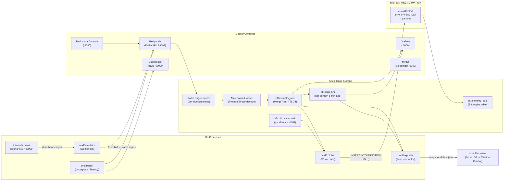
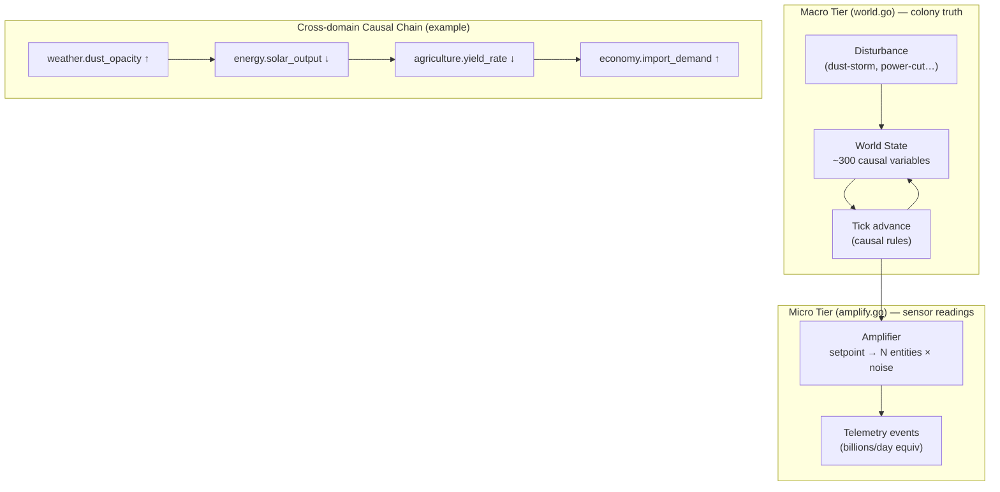
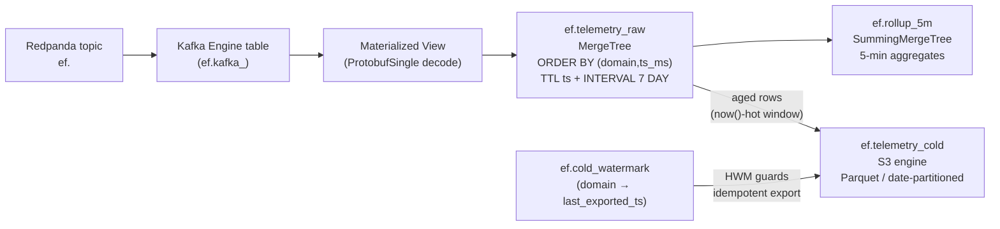
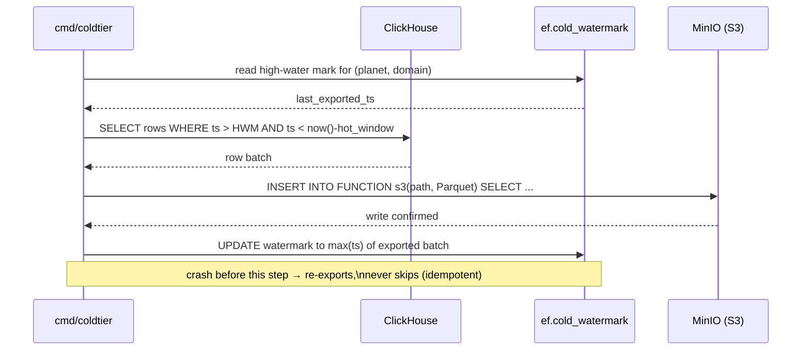

# EventForge — Planetary Telemetry Pipeline (Phase 1)

## Context

A standalone, local, ₹0 data pipeline simulating a Mars colony emitting telemetry across 13 domains, processing it for sub-5-second analytics. Foundation for a planetary-scale observability platform — Marsapiens "Mission Control" is the first intended consumer.

Runs entirely via Docker Compose on a laptop. Nothing wired into the live Marsapiens site in Phase 1 — that port happens after the pipeline is proven.

## System Architecture



## Two-Tier Simulation



## Ingest Pipeline (ClickHouse)



## Hot/Cold Lakehouse Split (P1.3)



## Architecture — Stack

| Layer | Technology | Version |
|---|---|---|
| Event generator | Go | 1.23 |
| Message bus | Redpanda (Kafka API) | v24.2.7 |
| Event schema | Protobuf | `telemetry.proto` |
| OLAP store | ClickHouse | 24.8 |
| Dashboards | Grafana | 11.2.0 |
| Cold store | MinIO (local) / AWS S3 (prod) | S3-compat |
| Cold format | Parquet | date-partitioned |
| Kafka client | franz-go | — |

## Phases Built (all ✅)

### P1.0 — Pipeline skeleton
- Docker Compose: Redpanda + ClickHouse + Grafana + Redpanda Console
- Custom ClickHouse entrypoint waits for Redpanda health before running init SQL
- ClickHouse Kafka Engine → Materialized View → `ef.telemetry_raw` (MergeTree, TTL 7d)
- `cmd/simulator`: flat random events → Protobuf → per-domain Kafka topics
- `make up` / `make sim` / `make verify` / `make down` / `make clean`

### P1.1 — Stateful two-tier simulation + scenario injection API
- **Macro tier** (`internal/sim/world.go`): colony truth — causally-linked state values advancing each tick (dust storm → energy ↓ → agriculture ↓ → economy ↑)
- **Micro tier** (`internal/amplify/amplify.go`): fans each macro setpoint out to thousands of per-entity sensor readings with noise → billions/day, anchored to macro truth
- **Control API** (`internal/control/control.go`): HTTP server on `:8090` — `POST /inject/dust-storm`, `GET /state`

### P1.2 — Rollups, benchmark, colony dashboard
- `cmd/bench`: throughput + end-to-end latency reporter; target ≥12k ev/s @ sub-5s (≈1B events/day)
- ClickHouse 5-minute rollup materialized views per domain
- Grafana "Colony" + "Pipeline Ops" dashboards (auto-provisioned)

### P1.3 — S3/Parquet cold tier (lakehouse split)
- MinIO + `mc` init containers added to Docker Compose; bucket `ef-cold` auto-created
- `cmd/coldtier`: incremental, idempotent archiver using per-domain high-water marks
- Path: `ef-cold/cold/<domain>/dt=YYYY-MM-DD/<domain>-<nanos>.parquet`
- `ef.telemetry_cold`: S3-engine table — cold history queryable in SQL, UNIONable with hot
- Identical code archives to real AWS S3 by swapping endpoint + credentials only
- **Fixup** (`fca454b`): three bugs fixed after Docker validation — ClickHouse S3 URL format, watermark upsert syntax, Parquet column type mapping

### P1.4 — Snapshot exporter
- `cmd/exporter`: reads latest rollup state from ClickHouse, writes `snapshots/latest.json`
- JSON artifact is the interface the future Marsapiens "Mission Control" page will consume

## Key Commands

```bash
make up                  # start all services, create topics
make sim                 # run two-tier simulation
make verify              # row count / freshness / domain coverage check
make bench RATE=15000    # throughput + latency report
make cold HOT=1m         # archive rows older than 1m to MinIO as Parquet
make cold-verify         # hot vs cold row counts per domain
go run ./cmd/exporter -once   # write snapshots/latest.json

# live cascade demo (while make sim is running):
curl -XPOST 'localhost:8090/inject/dust-storm?region=elysium&severity=0.9'
curl localhost:8090/state
```

## Services

| Service | URL | Credentials |
|---|---|---|
| Grafana | http://localhost:3000 | anonymous admin |
| Redpanda Console | http://localhost:8080 | — |
| ClickHouse HTTP | http://localhost:8123 | — |
| MinIO Console | http://localhost:9090 | `minioadmin` / `minioadmin` |

## File Layout

| Path | What |
|---|---|
| `proto/` | Telemetry schema + generated Go bindings |
| `cmd/simulator/` | Event generator |
| `cmd/bench/` | Throughput / latency benchmark |
| `cmd/exporter/` | Snapshot exporter → `snapshots/latest.json` |
| `cmd/coldtier/` | S3/Parquet cold-tier archiver |
| `internal/config/` | Colony catalog: 13 domains, regions, entities, metrics |
| `internal/producer/` | franz-go Kafka producer wrapper |
| `internal/sim/` | Macro world model (causal rules) |
| `internal/amplify/` | Micro fan-out (setpoint → per-entity noise) |
| `internal/control/` | Scenario injection HTTP API |
| `internal/event/` | Shared event types |
| `clickhouse/init/` | DB init SQL: Kafka Engine, raw table, rollups, cold-tier S3 tables |
| `grafana/` | Datasource + dashboard provisioning |

## Next: Port to Marsapiens

After end-to-end validation on Docker (`make up` + `make sim` + `make bench` + `make cold`):
- Build "Mission Control" page in Marsapiens `src/` that polls `snapshots/latest.json`
- Wire snapshot exporter output to an S3 path served via CloudFront
- Phase 2: real colony telemetry from agent activity → same pipeline

## Commits

| Commit | Phase | Description |
|---|---|---|
| `8381743` | P1.0 | Pipeline skeleton: Redpanda + ClickHouse + Grafana + Kafka Engine |
| `685e6f3` | P1.1/P1.2/P1.4 | Two-tier sim, benchmark, rollups, colony dashboard, snapshot exporter |
| `ef5ffad` | P1.3 | S3/Parquet cold tier: MinIO, coldtier cmd, lakehouse SQL |
| `fca454b` | P1.3 fixup | Docker validation: three bugs fixed (S3 URL, watermark upsert, Parquet types) |
